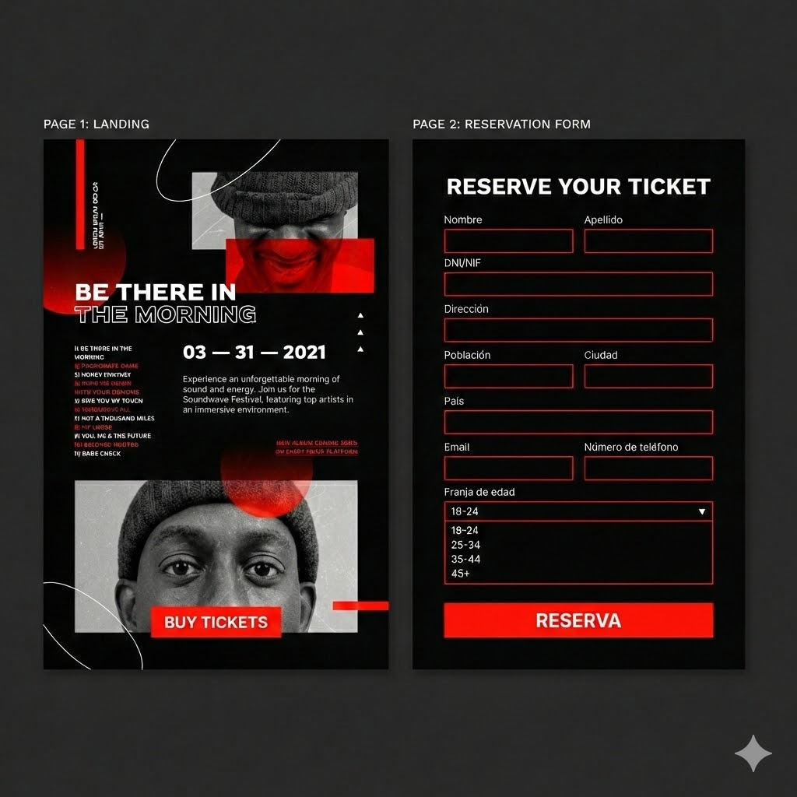

# Music Festival Event

El objetivo es crear una _landing page_ para la compra de tickets para un evento de música. Tendremos dos páginas:

1. Información principal sobre el evento:
    - Imagen del evento
    - Título
    - Descripción
    - Lista de los grupos que participan
    - Botón de compra

2. Formulario para la reserva del ticket en el que debe aparecer:
    - Nombre
    - Apellido
    - DNI (Documento de Identificación Fiscal)
    - Población
    - Ciudad
    - País
    - Dirección
    - Email
    - Número de teléfono
    - Desplegable con las franjas de edad
    - Botón de Reserva

Te dejamos una idea de diseño:

