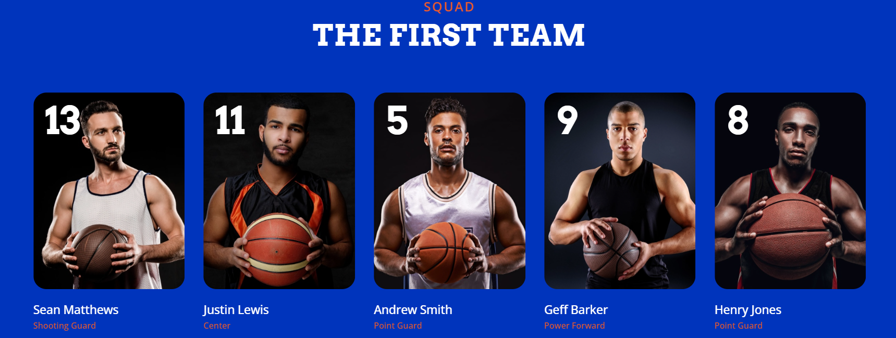

# THE TEAM

¿Qué tal si muestras en una página los miembros y datos del equipo del cual eres entrenador? Seguro que hasta en sueños lo has pensado.

En primer lugar elige un deporte o una competición que te guste (si además es lo más real posible sería fantástico).

Diseña una página que tenga como mínimo los siguientes aspectos trabajados a lo largo del capítulo:

1. El contenido principal será una foto de todos los miembros del equipo, al menos 9 miembros utilizando flex.
2. Para cada miembro, además de la foto,  aparecerán dos datos del mismo en portada en tipo texto de la siguiente forma:La compañía  
    - Crea una ventana de que señale más información de los jugadores mediante el componente Modal
    - En uno de los jugadores se aplicará un PopOver indicando que es un nuevo fichaje
3. Crea un carousel con un mínimo de 3 imágenes de algún evento, torneo u otra foto importante del equipo. 
4. Crea una barra de navegación y aplica scrollspy accediendo a los dos apartados creados

¡Ánimo!